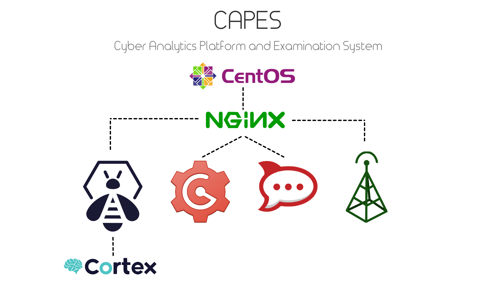

# Cyber Analytics Platform and Examination System (CAPES)
This is the project page for the CAPES project (in order of priority).

CAPES is an operational-focused service hub for segmented, self-hosted, and offline (if necessary) incident response, intelligence analysis, and hunt operations.



## Services
1. Rocketchat
1. Etherpad
1. GoGS
1. TheHive
1. Cortex
1. Landing Page
1. CyberChef
1. Mumble *
1. Hippocampe (waiting on TheHive project owner to update to ES 5.5)

## Roadmap
1. Get working shell script for all services
1. Get shell scripts combined into a singular CAPES deploy script
1. Documentation *
1. Convert shell script to Ansible
1. Convert CAPES to Docker

## Done
* Working shell scripts
  - RocketChat
  - Etherpad
  - GoGS
  - TheHive
  - Cortex
  - CyberChef
  - CAPES Landing Page
* CAPES deploy script with Landing Page presenting:
  - RocketChat
  - CyberChef
  - GoGS
  - Etherpad
  - TheHive
  - Cortex

## Note
\* designates current effort

## Documentation / Installation
```
$ sudo yum -y install git
$ git clone https://github.com/capesstack/capes.git
$ cd capes
$ sudo sh deploy_capes.sh
```
See [docs](docs/README.md) for detailed instructions.
