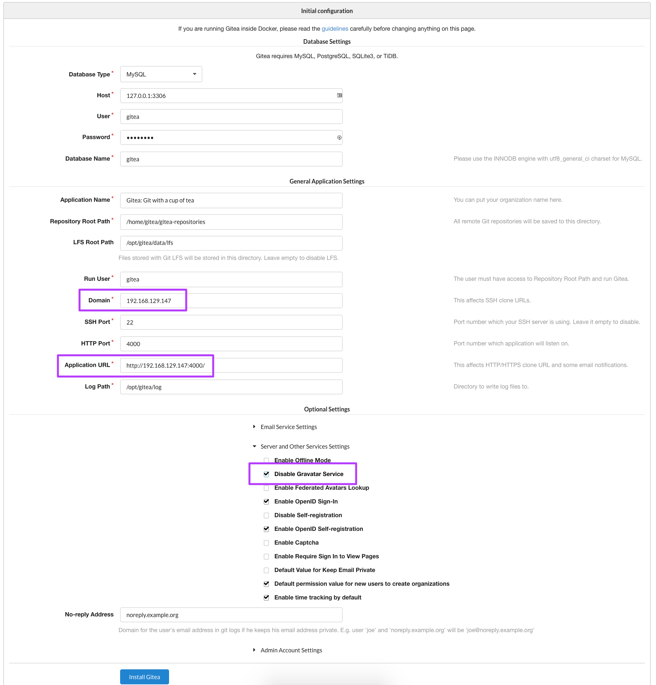

# Gitea Build, Operate, Maintain
This project is created and maintained by the Gitea team. All credit for the service goes to their talented team.

_Gitea - Git with a cup of tea. A painless self-hosted Git service._

_Gitea is a community managed fork of GoGS. The goal of this project is to make the easiest, fastest, and most painless way of setting up a self-hosted Git service. With Go, this can be done with an independent binary distribution across ALL platforms that Go supports, including Linux, Mac OS X, Windows and ARM._

## Build

### Dependencies
Below are the dependencies for Gitea. These are installed using `deploy_capes.sh` script.

| Package      | Version           |
|--------------|-------------------|
| mariadb-server          | 5.5.56-MariaDB  |
| gitea         | 1ed7f18 |

### Server Build
Please see the [server build instructions](../docs/README.md#build-your-os).

### Installation
Run the [CAPES deployment script](../deploy_capes.sh) or or the [independent Gitea deployment script](deploy_gitea.sh).

Deploying with CAPES (recommended):
```
sudo yum install -y git
git clone https://github.com/capesstack/capes.git
cd capes
sudo sh deploy_capes.sh
```
Browse to `http://<CAPES-system>` and click on "Gitea" from the "Services" dropdown.

Deploying manually:
```
sudo yum install -y git
git clone https://github.com/capesstack/capes.git
cd capes/gitea/
sudo sh deploy_gitea.sh
```
Browse to `http://<Cgitea-system>:4000`

#### Post-Install Configuration
When you browse to Gitea for the first time, you'll enter a post-installation configuration pipeline.

* The database user will be `gitea` and the passphrase will be what you set at the beginning of the install process  
* Use the explicit IP of the Gitea server instead of `localhost` for the `Domain` and `Application URL` fields  
* Under `Server and other Services Settings` check the `Disable Avatar Service` box  



##### Configure SSH Usage

Gitea provides the ability to perform git functions via http or ssh.  In order to enable `ssh` complete the following steps:  

* edit gitea's app.ini file  
`sudo vi /opt/gitea/custom/conf/app.ini`  

make the following changes & additions to the `[server]` section:  

`START_SSH_SERVER = true`     # ensure this is set to true  
`DISABLE_SSH      = false`    # ensure this is set to false  
`SSH_PORT         = 4001`     # set this to any available port that is **NOT 22**   
`SSH_LISTEN_PORT  = 4001`     # set this to any available port that is **NOT 22**  

here's an example (showing only the `[server]` section):  
```
...

[server]
LOCAL_ROOT_URL   = http://localhost:4000/
SSH_DOMAIN       = <ip>
START_SSH_SERVER = true
DOMAIN           = <ip>
HTTP_PORT        = 4000
ROOT_URL         = http://<ip>:4000/
DISABLE_SSH      = false
SSH_PORT         = 4001
SSH_LISTEN_PORT  = 4001
LFS_START_SERVER = true
LFS_CONTENT_PATH = /opt/gitea/data/lfs
LFS_JWT_SECRET   = xxxxxxxxxxxxxxxxxxx
OFFLINE_MODE     = false

...:
```
##### Wrapping it up
```
sudo firewall-cmd --add-port=4001/tcp --permanent
sudo firewall-cmd --reload
sudo systemctl restart gitea
sudo systemctl restart sshd
```

## Operate
Immediately after you complete the post-installation configuration, you'll be presented with a login screen. Click on `Need an account? Sign up now.` This account will be the administrator.

** Note: the username `admin` is reserved...but not for you; so pick something different.**

### Admin Panel
If you click on your avatar logo, you can select the `Admin Panel`.

#### Dashboard
Statistics, Operations, and System Monitor Status sections - discussed in the [Maintain](#maintain) section.

#### Users
Here are where your accounts are stored...pretty self explanatory.

#### Organizations
Organizations simplify management of group-owned repositories (for example: your company's code), expand on our permissions system, and help focus your workflow projects.

If you've ever had to manage multiple accounts, desired a company-specific dashboard, wanted to add read-only collaborators, or needed to give someone else administrative control over one of your repositories, you're going to love Organizations.

#### Repositories
A repository is a central file storage location. It is used by version control systems to store multiple versions of files. While a repository can be configured on a local machine for a single user, it is often stored on a server, which can be accessed by multiple users.

A repository contains three primary elements — a trunk, branches, and tags:
* The trunk contains the current version of a software project. This may include multiple source code files, as well as other resources used by the program.
* Branches are used to store new versions of the program. A developer may create a new branch whenever substantial revisions are made to the program. If a branch contains unwanted changes, it can be discontinued. Otherwise, it can be merged back into the trunk as the latest version.
* Tags are used to save versions of a project, but are not meant for active development. For example, a developer may create a "release tag" each time a new version of the software is released.

A repository provides a structured way for programmers to store development files. This can be helpful for any type of software development, but it is especially important for large development projects. By committing changes to a repository, developers can quickly revert to a previous version of a program if a recent update causes bugs or other problems.

#### Authentications
Gitea offers four authentication options, LDAP (BindDN or simple auth), SMTP, PAM, or local.

There are many different configurations for authentication, please see the [GoGS project documentation on this topic](https://gogs.io/docs/features/authentication).

By default, you're using `Local`.

#### Configuration
This menu tab displays your configuration settings, although you cannot make any changes from this screen.

#### System Notices
This menu tab displays any system messages.

#### Monitoring
This menu tab displays the status of various system tasks.

## Maintain

### Admin Panel - Dashboard
#### Statistics
Provides Gitea stats on:
* Users
* Organizations
* Public keys
* Repositories
* Watches
* Stars
* Actions
* Accesses
* Issues
* Comments
* Social Accounts
* Follows
* Mirrors
* Releases
* Login Sources
* Webhooks
* Milestones
* Labels
* Hook Tasks
* Teams
* Update Tasks
* Attachments

#### Operations
There are several system operation jobs that you can run here:
* Delete all inactive accounts
* Delete all repository archives
* Delete all repository records that lost Git files
* Do garbage collection on repositories
* Rewrite `.ssh/authorized_keys` file
* Resync pre-receive, update, and post-receive hooks of all repositories
* Reinitialize all repository records that lost Git files

#### System Monitor Status
Tracks the status of the system, such as RAM, disk usage, latency times, uptime, etc.

## Troubleshooting
In the event that you have any issues, here are some things you can check to make sure they're operating as intended.

You may be having an issue with your firewall. Check the troubleshooting steps [here](../landing_page/build_operate_maintain.md#troubleshooting)

Check with the GoGS project maintainers at https://gogs.io or the Gitea project maintainers at https://gitea.io

If you're still unable to access the Gitea page from a web browser, [please file an issue](https://github.com/capesstack/capes/issues).
